# importação de bibliotecas


```python
import numpy as np
import pandas as pd
import seaborn as sns
import matplotlib.pyplot as plt
from scipy import stats
```

# Importando CSV


```python
#criando dataframe
df = pd.read_csv("penguins.csv")
df.head()
```


<div>
<style scoped>
    .dataframe tbody tr th:only-of-type {
        vertical-align: middle;
    }

    .dataframe tbody tr th {
        vertical-align: top;
    }

    .dataframe thead th {
        text-align: right;
    }
</style>
<table border="1" class="dataframe">
  <thead>
    <tr style="text-align: right;">
      <th></th>
      <th>species</th>
      <th>island</th>
      <th>bill_length_mm</th>
      <th>bill_depth_mm</th>
      <th>flipper_length_mm</th>
      <th>body_mass_g</th>
      <th>sex</th>
    </tr>
  </thead>
  <tbody>
    <tr>
      <th>0</th>
      <td>Adelie</td>
      <td>Torgersen</td>
      <td>39.1</td>
      <td>18.7</td>
      <td>181.0</td>
      <td>3750.0</td>
      <td>MALE</td>
    </tr>
    <tr>
      <th>1</th>
      <td>Adelie</td>
      <td>Torgersen</td>
      <td>39.5</td>
      <td>17.4</td>
      <td>186.0</td>
      <td>3800.0</td>
      <td>FEMALE</td>
    </tr>
    <tr>
      <th>2</th>
      <td>Adelie</td>
      <td>Torgersen</td>
      <td>40.3</td>
      <td>18.0</td>
      <td>195.0</td>
      <td>3250.0</td>
      <td>FEMALE</td>
    </tr>
    <tr>
      <th>3</th>
      <td>Adelie</td>
      <td>Torgersen</td>
      <td>NaN</td>
      <td>NaN</td>
      <td>NaN</td>
      <td>NaN</td>
      <td>NaN</td>
    </tr>
    <tr>
      <th>4</th>
      <td>Adelie</td>
      <td>Torgersen</td>
      <td>36.7</td>
      <td>19.3</td>
      <td>193.0</td>
      <td>3450.0</td>
      <td>FEMALE</td>
    </tr>
  </tbody>
</table>
</div>


# limpeza dos dados

## dropando dados nulos


```python

print(df.isnull().sum())
df = df.dropna()
```

    species               0
    island                0
    bill_length_mm        2
    bill_depth_mm         2
    flipper_length_mm     2
    body_mass_g           2
    sex                  11
    dtype: int64


## dropando dados duplicados


```python
print(df.duplicated().sum())
df = df.drop_duplicates()
```

    0


# buscando outlier


```python
colunas_numericas = df.select_dtypes(include=['number']).columns

for col in colunas_numericas:
    Q1 = np.percentile(df[col],25, interpolation='midpoint')
    Q3 = np.percentile(df[col],75, interpolation='midpoint')
    IRQ = Q3-Q1
    print(f'coluna : {col}')
    print(f'primeiro quartil : {Q1}')
    print(f'terceiro quartil : {Q3}')
    print(f'intervalo quartil: {IRQ}')

    upper = np.where(df[col]>=(Q3+1.5*IRQ))
    lower = np.where(df[col]<=(Q1-1.5*IRQ))
    print(f'length upper : {upper[0].size}')
    print(f'length lower : {lower[0].size}')

    df = df.drop(upper[0])
    df = df.drop(lower[0])
    print("----------------------")
```

    coluna : bill_length_mm
    primeiro quartil : 39.5
    terceiro quartil : 48.6
    intervalo quartil: 9.100000000000001
    length upper : 0
    length lower : 0
    ----------------------
    coluna : bill_depth_mm
    primeiro quartil : 15.6
    terceiro quartil : 18.7
    intervalo quartil: 3.0999999999999996
    length upper : 0
    length lower : 0
    ----------------------
    coluna : flipper_length_mm
    primeiro quartil : 190.0
    terceiro quartil : 213.0
    intervalo quartil: 23.0
    length upper : 0
    length lower : 0
    ----------------------
    coluna : body_mass_g
    primeiro quartil : 3550.0
    terceiro quartil : 4775.0
    intervalo quartil: 1225.0
    length upper : 0
    length lower : 0
    ----------------------


# Represetando dados em graficos

## boxplot


```python
#representando dados em graficos

colunas_numericas = df.select_dtypes(include=['number']).columns
fig, axes = plt.subplots(nrows=len(colunas_numericas), ncols=1, figsize=(8, len(colunas_numericas) * 4))
if len(colunas_numericas) == 1:
    axes = [axes]
for i, coluna in enumerate(colunas_numericas):
    sns.boxplot(x=df[coluna], ax=axes[i])
    axes[i].set_title(coluna)
plt.tight_layout()
plt.show()
```


    
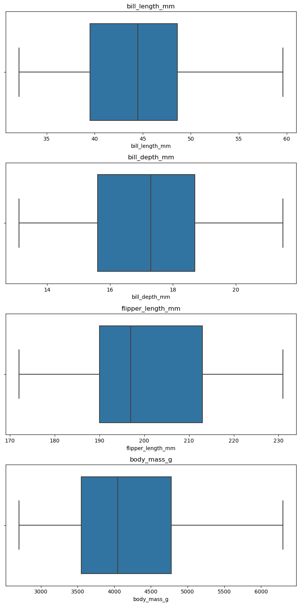
    


observasse que nao ha outliers e que os dados não estao bem distribuidos

## histograma


```python

colunas_numericas = df.select_dtypes(include=['number']).columns
fig, axes = plt.subplots(nrows=len(colunas_numericas), ncols=1, figsize=(8, len(colunas_numericas) * 4))


if len(colunas_numericas) == 1:
    axes = [axes]


for i, coluna in enumerate(colunas_numericas):
    axes[i].hist(df[coluna], bins=10, color='skyblue', edgecolor='black')
    axes[i].set_title(coluna)

plt.tight_layout()
plt.show()
```


    
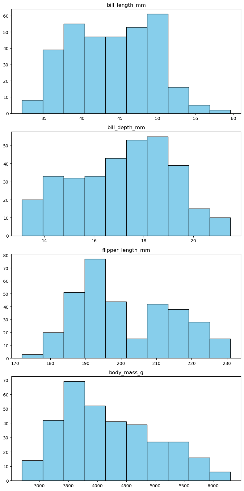
    


## Scatterplot


```python
sns.scatterplot(x='bill_length_mm' , y= 'bill_depth_mm' ,hue='species', data=df )
```


    <Axes: xlabel='bill_length_mm', ylabel='bill_depth_mm'>


    
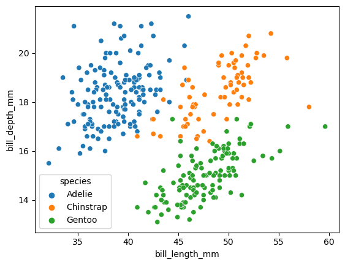
    


é possivel ver que existe agrupamentos nos dados


```python
sns.scatterplot(x='flipper_length_mm' , y= 'body_mass_g' ,hue='sex', data=df )
```


    <Axes: xlabel='flipper_length_mm', ylabel='body_mass_g'>


    
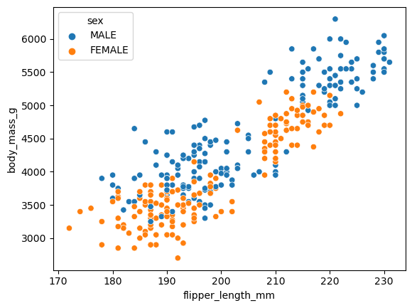
    


é possivel ver que existe agrupamentos nos dados


```python
 sns.countplot(x='species', data=df)
```


    <Axes: xlabel='species', ylabel='count'>


    
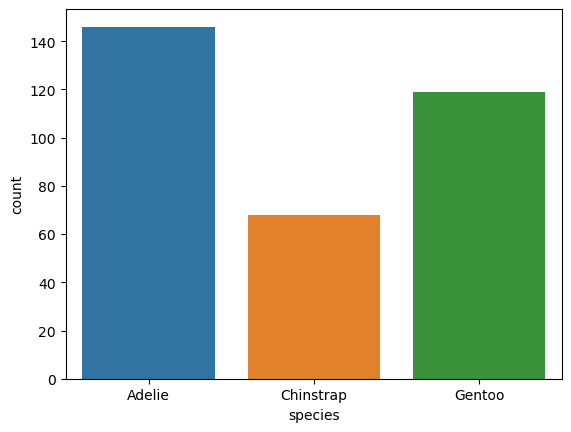
    


observasse que Adelie e Gentoo tem mais amostras que chinstrap

## pairplot


```python
 sns.pairplot(df, diag_kind='kde', hue='species')
```


    <seaborn.axisgrid.PairGrid at 0x7f0f2e035090>


    
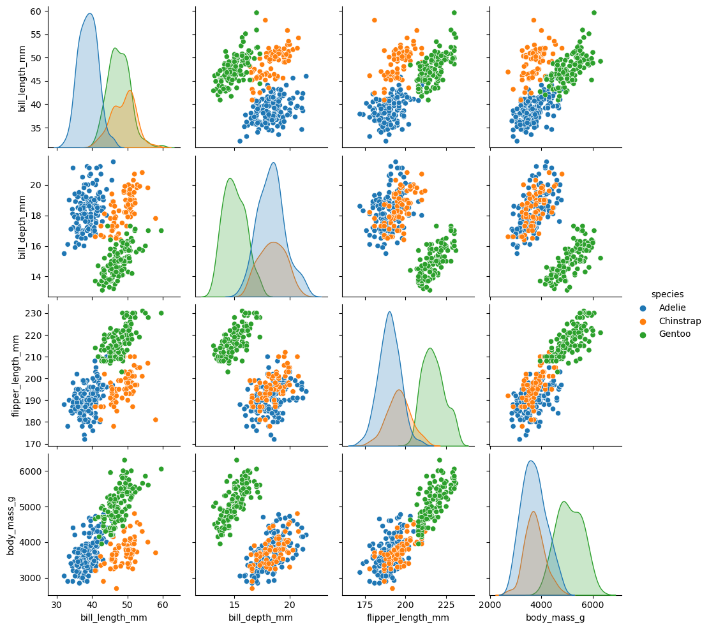
    


observasse novamente o agrupamento das especies em grupos

## facetGrid


```python
plot = sns.FacetGrid(df, hue='species')
plot.map(sns.distplot, 'bill_length_mm').add_legend()
plot = sns.FacetGrid(df, hue='species')
plot.map(sns.distplot, 'flipper_length_mm').add_legend()
plot = sns.FacetGrid(df, hue='species')
plot.map(sns.distplot, 'bill_depth_mm').add_legend()
plot = sns.FacetGrid(df, hue='species')
plot.map(sns.distplot, 'body_mass_g').add_legend()

```

    /home/augusto/anaconda3/lib/python3.11/site-packages/seaborn/axisgrid.py:848: UserWarning: 
    
    `distplot` is a deprecated function and will be removed in seaborn v0.14.0.
    
    Please adapt your code to use either `displot` (a figure-level function with
    similar flexibility) or `histplot` (an axes-level function for histograms).
    
    For a guide to updating your code to use the new functions, please see
    https://gist.github.com/mwaskom/de44147ed2974457ad6372750bbe5751
    
      func(*plot_args, **plot_kwargs)
    /home/augusto/anaconda3/lib/python3.11/site-packages/seaborn/axisgrid.py:848: UserWarning: 
    
    `distplot` is a deprecated function and will be removed in seaborn v0.14.0.
    
    Please adapt your code to use either `displot` (a figure-level function with
    similar flexibility) or `histplot` (an axes-level function for histograms).
    
    For a guide to updating your code to use the new functions, please see
    https://gist.github.com/mwaskom/de44147ed2974457ad6372750bbe5751
    
      func(*plot_args, **plot_kwargs)
    /home/augusto/anaconda3/lib/python3.11/site-packages/seaborn/axisgrid.py:848: UserWarning: 
    
    `distplot` is a deprecated function and will be removed in seaborn v0.14.0.
    
    Please adapt your code to use either `displot` (a figure-level function with
    similar flexibility) or `histplot` (an axes-level function for histograms).
    
    For a guide to updating your code to use the new functions, please see
    https://gist.github.com/mwaskom/de44147ed2974457ad6372750bbe5751
    
      func(*plot_args, **plot_kwargs)
    /home/augusto/anaconda3/lib/python3.11/site-packages/seaborn/axisgrid.py:848: UserWarning: 
    
    `distplot` is a deprecated function and will be removed in seaborn v0.14.0.
    
    Please adapt your code to use either `displot` (a figure-level function with
    similar flexibility) or `histplot` (an axes-level function for histograms).
    
    For a guide to updating your code to use the new functions, please see
    https://gist.github.com/mwaskom/de44147ed2974457ad6372750bbe5751
    
      func(*plot_args, **plot_kwargs)
    /home/augusto/anaconda3/lib/python3.11/site-packages/seaborn/axisgrid.py:848: UserWarning: 
    
    `distplot` is a deprecated function and will be removed in seaborn v0.14.0.
    
    Please adapt your code to use either `displot` (a figure-level function with
    similar flexibility) or `histplot` (an axes-level function for histograms).
    
    For a guide to updating your code to use the new functions, please see
    https://gist.github.com/mwaskom/de44147ed2974457ad6372750bbe5751
    
      func(*plot_args, **plot_kwargs)
    /home/augusto/anaconda3/lib/python3.11/site-packages/seaborn/axisgrid.py:848: UserWarning: 
    
    `distplot` is a deprecated function and will be removed in seaborn v0.14.0.
    
    Please adapt your code to use either `displot` (a figure-level function with
    similar flexibility) or `histplot` (an axes-level function for histograms).
    
    For a guide to updating your code to use the new functions, please see
    https://gist.github.com/mwaskom/de44147ed2974457ad6372750bbe5751
    
      func(*plot_args, **plot_kwargs)
    /home/augusto/anaconda3/lib/python3.11/site-packages/seaborn/axisgrid.py:848: UserWarning: 
    
    `distplot` is a deprecated function and will be removed in seaborn v0.14.0.
    
    Please adapt your code to use either `displot` (a figure-level function with
    similar flexibility) or `histplot` (an axes-level function for histograms).
    
    For a guide to updating your code to use the new functions, please see
    https://gist.github.com/mwaskom/de44147ed2974457ad6372750bbe5751
    
      func(*plot_args, **plot_kwargs)
    /home/augusto/anaconda3/lib/python3.11/site-packages/seaborn/axisgrid.py:848: UserWarning: 
    
    `distplot` is a deprecated function and will be removed in seaborn v0.14.0.
    
    Please adapt your code to use either `displot` (a figure-level function with
    similar flexibility) or `histplot` (an axes-level function for histograms).
    
    For a guide to updating your code to use the new functions, please see
    https://gist.github.com/mwaskom/de44147ed2974457ad6372750bbe5751
    
      func(*plot_args, **plot_kwargs)
    /home/augusto/anaconda3/lib/python3.11/site-packages/seaborn/axisgrid.py:848: UserWarning: 
    
    `distplot` is a deprecated function and will be removed in seaborn v0.14.0.
    
    Please adapt your code to use either `displot` (a figure-level function with
    similar flexibility) or `histplot` (an axes-level function for histograms).
    
    For a guide to updating your code to use the new functions, please see
    https://gist.github.com/mwaskom/de44147ed2974457ad6372750bbe5751
    
      func(*plot_args, **plot_kwargs)
    /home/augusto/anaconda3/lib/python3.11/site-packages/seaborn/axisgrid.py:848: UserWarning: 
    
    `distplot` is a deprecated function and will be removed in seaborn v0.14.0.
    
    Please adapt your code to use either `displot` (a figure-level function with
    similar flexibility) or `histplot` (an axes-level function for histograms).
    
    For a guide to updating your code to use the new functions, please see
    https://gist.github.com/mwaskom/de44147ed2974457ad6372750bbe5751
    
      func(*plot_args, **plot_kwargs)
    /home/augusto/anaconda3/lib/python3.11/site-packages/seaborn/axisgrid.py:848: UserWarning: 
    
    `distplot` is a deprecated function and will be removed in seaborn v0.14.0.
    
    Please adapt your code to use either `displot` (a figure-level function with
    similar flexibility) or `histplot` (an axes-level function for histograms).
    
    For a guide to updating your code to use the new functions, please see
    https://gist.github.com/mwaskom/de44147ed2974457ad6372750bbe5751
    
      func(*plot_args, **plot_kwargs)
    /home/augusto/anaconda3/lib/python3.11/site-packages/seaborn/axisgrid.py:848: UserWarning: 
    
    `distplot` is a deprecated function and will be removed in seaborn v0.14.0.
    
    Please adapt your code to use either `displot` (a figure-level function with
    similar flexibility) or `histplot` (an axes-level function for histograms).
    
    For a guide to updating your code to use the new functions, please see
    https://gist.github.com/mwaskom/de44147ed2974457ad6372750bbe5751
    
      func(*plot_args, **plot_kwargs)


    <seaborn.axisgrid.FacetGrid at 0x7f0f2ecfc310>


    
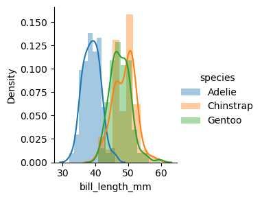
    


    
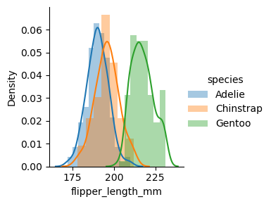
    


    
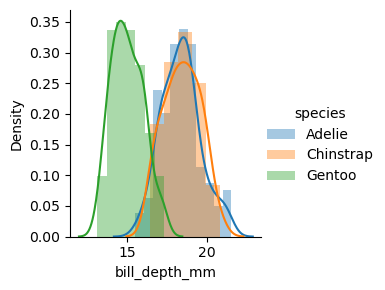
    


    
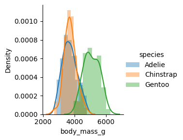
    


## heatmap


```python
plt.figure(figsize=(10, 8))
plt.xticks(rotation=45, ha='right')
plt.yticks(rotation=0)
sns.heatmap(df.corr(method='pearson', numeric_only=True),  annot=True, fmt=".2f")
```


    <Axes: >


    
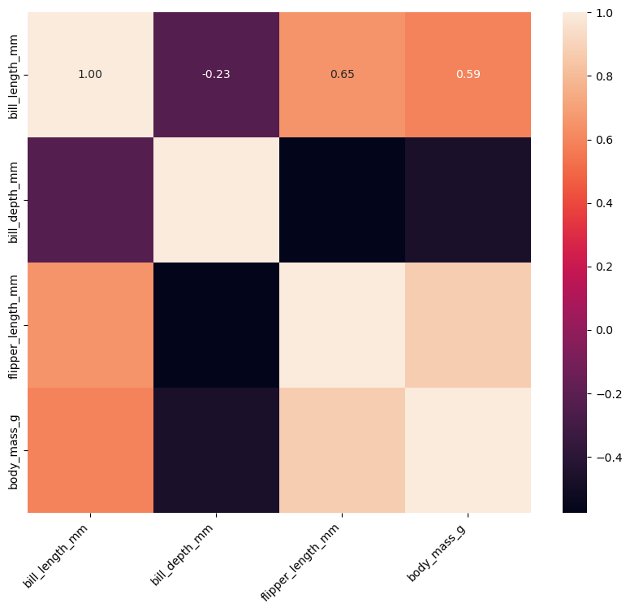
    


```python
df.corr(method='pearson', numeric_only=True)
```


<div>
<style scoped>
    .dataframe tbody tr th:only-of-type {
        vertical-align: middle;
    }

    .dataframe tbody tr th {
        vertical-align: top;
    }

    .dataframe thead th {
        text-align: right;
    }
</style>
<table border="1" class="dataframe">
  <thead>
    <tr style="text-align: right;">
      <th></th>
      <th>bill_length_mm</th>
      <th>bill_depth_mm</th>
      <th>flipper_length_mm</th>
      <th>body_mass_g</th>
    </tr>
  </thead>
  <tbody>
    <tr>
      <th>bill_length_mm</th>
      <td>1.000000</td>
      <td>-0.228626</td>
      <td>0.653096</td>
      <td>0.589451</td>
    </tr>
    <tr>
      <th>bill_depth_mm</th>
      <td>-0.228626</td>
      <td>1.000000</td>
      <td>-0.577792</td>
      <td>-0.472016</td>
    </tr>
    <tr>
      <th>flipper_length_mm</th>
      <td>0.653096</td>
      <td>-0.577792</td>
      <td>1.000000</td>
      <td>0.872979</td>
    </tr>
    <tr>
      <th>body_mass_g</th>
      <td>0.589451</td>
      <td>-0.472016</td>
      <td>0.872979</td>
      <td>1.000000</td>
    </tr>
  </tbody>
</table>
</div>


minha versão do seaborn esta bugada, mas olhando os dados de correção , observasse que :

flipper_length_mm X  body_mass_g tem uma forte relação


```python

```
