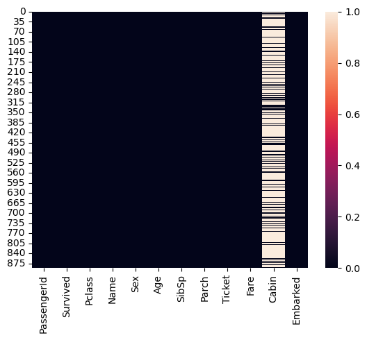

```python
import numpy as np
import pandas as pd
import seaborn as sns
import matplotlib.pyplot as plt
from scipy import stats
df = pd.read_csv("titanic.csv")
df.head()
```


<div>
<style scoped>
    .dataframe tbody tr th:only-of-type {
        vertical-align: middle;
    }

    .dataframe tbody tr th {
        vertical-align: top;
    }

    .dataframe thead th {
        text-align: right;
    }
</style>
<table border="1" class="dataframe">
  <thead>
    <tr style="text-align: right;">
      <th></th>
      <th>PassengerId</th>
      <th>Survived</th>
      <th>Pclass</th>
      <th>Name</th>
      <th>Sex</th>
      <th>Age</th>
      <th>SibSp</th>
      <th>Parch</th>
      <th>Ticket</th>
      <th>Fare</th>
      <th>Cabin</th>
      <th>Embarked</th>
    </tr>
  </thead>
  <tbody>
    <tr>
      <th>0</th>
      <td>1</td>
      <td>0</td>
      <td>3</td>
      <td>Braund, Mr. Owen Harris</td>
      <td>male</td>
      <td>22.0</td>
      <td>1</td>
      <td>0</td>
      <td>A/5 21171</td>
      <td>7.2500</td>
      <td>NaN</td>
      <td>S</td>
    </tr>
    <tr>
      <th>1</th>
      <td>2</td>
      <td>1</td>
      <td>1</td>
      <td>Cumings, Mrs. John Bradley (Florence Briggs Th...</td>
      <td>female</td>
      <td>38.0</td>
      <td>1</td>
      <td>0</td>
      <td>PC 17599</td>
      <td>71.2833</td>
      <td>C85</td>
      <td>C</td>
    </tr>
    <tr>
      <th>2</th>
      <td>3</td>
      <td>1</td>
      <td>3</td>
      <td>Heikkinen, Miss. Laina</td>
      <td>female</td>
      <td>26.0</td>
      <td>0</td>
      <td>0</td>
      <td>STON/O2. 3101282</td>
      <td>7.9250</td>
      <td>NaN</td>
      <td>S</td>
    </tr>
    <tr>
      <th>3</th>
      <td>4</td>
      <td>1</td>
      <td>1</td>
      <td>Futrelle, Mrs. Jacques Heath (Lily May Peel)</td>
      <td>female</td>
      <td>35.0</td>
      <td>1</td>
      <td>0</td>
      <td>113803</td>
      <td>53.1000</td>
      <td>C123</td>
      <td>S</td>
    </tr>
    <tr>
      <th>4</th>
      <td>5</td>
      <td>0</td>
      <td>3</td>
      <td>Allen, Mr. William Henry</td>
      <td>male</td>
      <td>35.0</td>
      <td>0</td>
      <td>0</td>
      <td>373450</td>
      <td>8.0500</td>
      <td>NaN</td>
      <td>S</td>
    </tr>
  </tbody>
</table>
</div>


```python
print(df.isnull().sum())
sns.heatmap(df.isnull())
```

    PassengerId      0
    Survived         0
    Pclass           0
    Name             0
    Sex              0
    Age            177
    SibSp            0
    Parch            0
    Ticket           0
    Fare             0
    Cabin          687
    Embarked         2
    dtype: int64


    <Axes: >


    

    


```python
df['Pclass'].unique()


for pc in df['Pclass'].unique():
    print(pc)
    passengers = df[df['Pclass'] == pc]
    print(passengers)
```

    3
         PassengerId  Survived  Pclass                                      Name  \
    0              1         0       3                   Braund, Mr. Owen Harris   
    2              3         1       3                    Heikkinen, Miss. Laina   
    4              5         0       3                  Allen, Mr. William Henry   
    5              6         0       3                          Moran, Mr. James   
    7              8         0       3            Palsson, Master. Gosta Leonard   
    ..           ...       ...     ...                                       ...   
    882          883         0       3              Dahlberg, Miss. Gerda Ulrika   
    884          885         0       3                    Sutehall, Mr. Henry Jr   
    885          886         0       3      Rice, Mrs. William (Margaret Norton)   
    888          889         0       3  Johnston, Miss. Catherine Helen "Carrie"   
    890          891         0       3                       Dooley, Mr. Patrick   
    
            Sex   Age  SibSp  Parch            Ticket     Fare Cabin Embarked  
    0      male  22.0      1      0         A/5 21171   7.2500   NaN        S  
    2    female  26.0      0      0  STON/O2. 3101282   7.9250   NaN        S  
    4      male  35.0      0      0            373450   8.0500   NaN        S  
    5      male   NaN      0      0            330877   8.4583   NaN        Q  
    7      male   2.0      3      1            349909  21.0750   NaN        S  
    ..      ...   ...    ...    ...               ...      ...   ...      ...  
    882  female  22.0      0      0              7552  10.5167   NaN        S  
    884    male  25.0      0      0   SOTON/OQ 392076   7.0500   NaN        S  
    885  female  39.0      0      5            382652  29.1250   NaN        Q  
    888  female   NaN      1      2        W./C. 6607  23.4500   NaN        S  
    890    male  32.0      0      0            370376   7.7500   NaN        Q  
    
    [491 rows x 12 columns]
    1
         PassengerId  Survived  Pclass  \
    1              2         1       1   
    3              4         1       1   
    6              7         0       1   
    11            12         1       1   
    23            24         1       1   
    ..           ...       ...     ...   
    871          872         1       1   
    872          873         0       1   
    879          880         1       1   
    887          888         1       1   
    889          890         1       1   
    
                                                      Name     Sex   Age  SibSp  \
    1    Cumings, Mrs. John Bradley (Florence Briggs Th...  female  38.0      1   
    3         Futrelle, Mrs. Jacques Heath (Lily May Peel)  female  35.0      1   
    6                              McCarthy, Mr. Timothy J    male  54.0      0   
    11                            Bonnell, Miss. Elizabeth  female  58.0      0   
    23                        Sloper, Mr. William Thompson    male  28.0      0   
    ..                                                 ...     ...   ...    ...   
    871   Beckwith, Mrs. Richard Leonard (Sallie Monypeny)  female  47.0      1   
    872                           Carlsson, Mr. Frans Olof    male  33.0      0   
    879      Potter, Mrs. Thomas Jr (Lily Alexenia Wilson)  female  56.0      0   
    887                       Graham, Miss. Margaret Edith  female  19.0      0   
    889                              Behr, Mr. Karl Howell    male  26.0      0   
    
         Parch    Ticket     Fare        Cabin Embarked  
    1        0  PC 17599  71.2833          C85        C  
    3        0    113803  53.1000         C123        S  
    6        0     17463  51.8625          E46        S  
    11       0    113783  26.5500         C103        S  
    23       0    113788  35.5000           A6        S  
    ..     ...       ...      ...          ...      ...  
    871      1     11751  52.5542          D35        S  
    872      0       695   5.0000  B51 B53 B55        S  
    879      1     11767  83.1583          C50        C  
    887      0    112053  30.0000          B42        S  
    889      0    111369  30.0000         C148        C  
    
    [216 rows x 12 columns]
    2
         PassengerId  Survived  Pclass  \
    9             10         1       2   
    15            16         1       2   
    17            18         1       2   
    20            21         0       2   
    21            22         1       2   
    ..           ...       ...     ...   
    866          867         1       2   
    874          875         1       2   
    880          881         1       2   
    883          884         0       2   
    886          887         0       2   
    
                                                 Name     Sex   Age  SibSp  Parch  \
    9             Nasser, Mrs. Nicholas (Adele Achem)  female  14.0      1      0   
    15               Hewlett, Mrs. (Mary D Kingcome)   female  55.0      0      0   
    17                   Williams, Mr. Charles Eugene    male   NaN      0      0   
    20                           Fynney, Mr. Joseph J    male  35.0      0      0   
    21                          Beesley, Mr. Lawrence    male  34.0      0      0   
    ..                                            ...     ...   ...    ...    ...   
    866                  Duran y More, Miss. Asuncion  female  27.0      1      0   
    874         Abelson, Mrs. Samuel (Hannah Wizosky)  female  28.0      1      0   
    880  Shelley, Mrs. William (Imanita Parrish Hall)  female  25.0      0      1   
    883                 Banfield, Mr. Frederick James    male  28.0      0      0   
    886                         Montvila, Rev. Juozas    male  27.0      0      0   
    
                   Ticket     Fare Cabin Embarked  
    9              237736  30.0708   NaN        C  
    15             248706  16.0000   NaN        S  
    17             244373  13.0000   NaN        S  
    20             239865  26.0000   NaN        S  
    21             248698  13.0000   D56        S  
    ..                ...      ...   ...      ...  
    866     SC/PARIS 2149  13.8583   NaN        C  
    874         P/PP 3381  24.0000   NaN        C  
    880            230433  26.0000   NaN        S  
    883  C.A./SOTON 34068  10.5000   NaN        S  
    886            211536  13.0000   NaN        S  
    
    [184 rows x 12 columns]


```python
def fill_missing_ages(df):
    medianGroup = df.groupby('Pclass')['Age'].median()
    for index, row in df.iterrows():
        if pd.isna(row['Age']):
            median_age = medianGroup[row['Pclass']]
            df.at[index, 'Age'] = median_age
    return df

print(fill_missing_ages(df).isnull().sum())
sns.heatmap(fill_missing_ages(df.isnull()))
```

    PassengerId      0
    Survived         0
    Pclass           0
    Name             0
    Sex              0
    Age              0
    SibSp            0
    Parch            0
    Ticket           0
    Fare             0
    Cabin          687
    Embarked         2
    dtype: int64


    <Axes: >


    

    


```python

```
